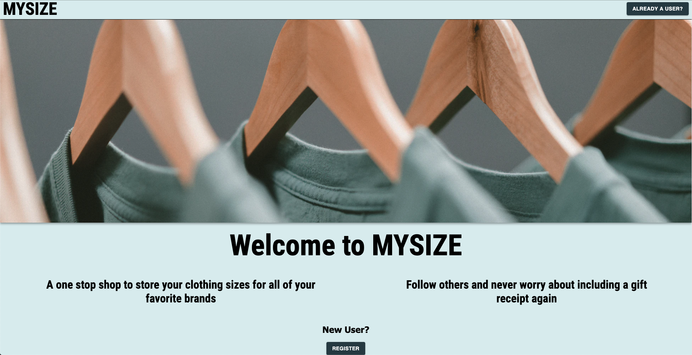
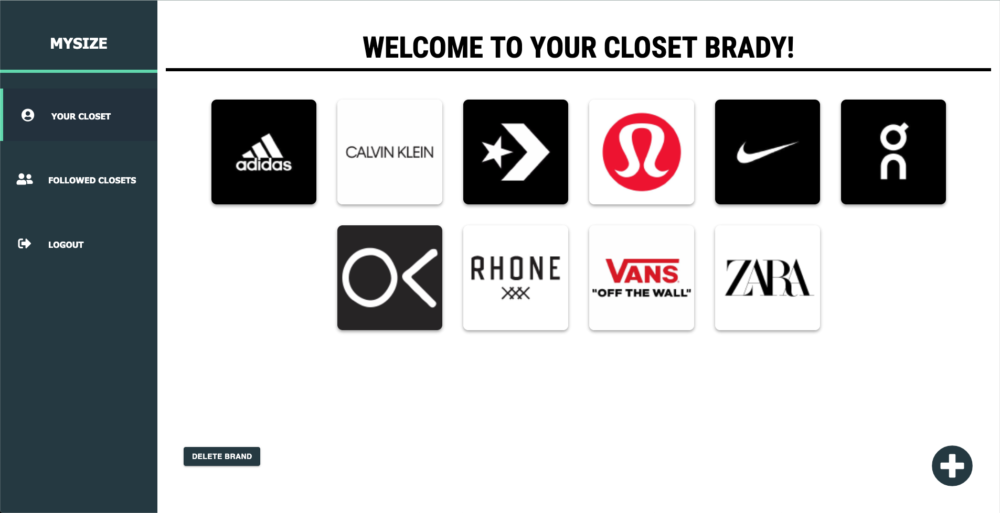
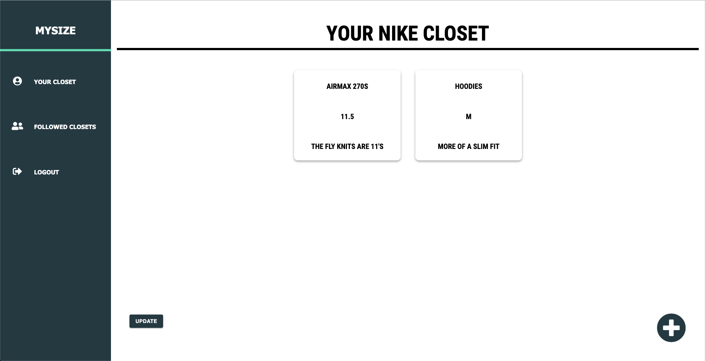
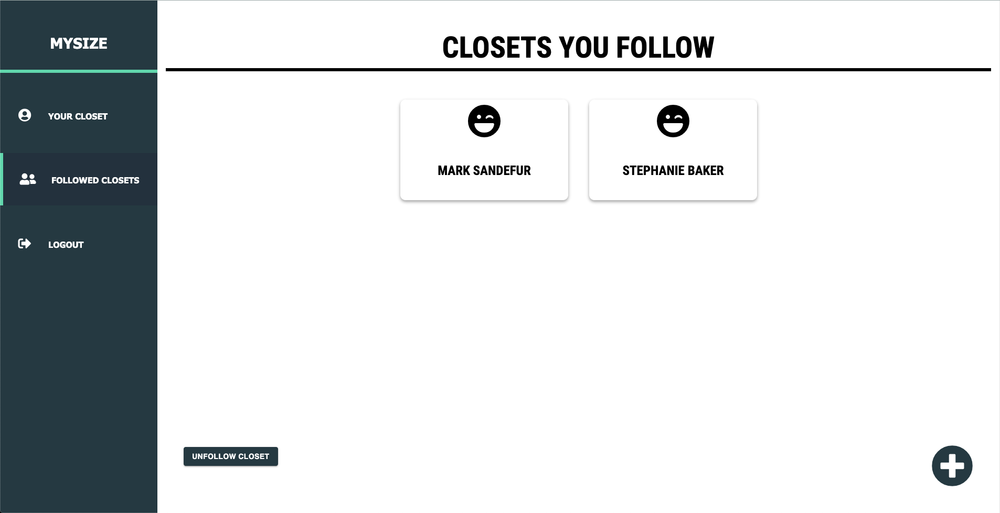

# MYSIZE

## Description

Duration: 2-week sprint

MYSIZE is an application that allows you to save your clothing sizes for specific clothing brands. MYSIZE also allows you follow other users on the app and see their favorite clothing brands and sizes.

MYSIZE seeks to eliminate any grey area that is involved in both buying clothes online for yourself, and when trying to give that perfect gift to someone you care about.

## Screen Shot

## Prerequisites

- Node.js
- Postico

## Installation

1. Open Postico
2. Copy code from database.sql into your db
3. run `npm install`
4. In two different terminals run `npm run server` and `npm run client`
5. Web app is viewable on localhost:3000

## Usage

- On load you will be brought to the landing page where you can register as a new user
- Once you log in you will be able to start adding brands to your closet with the '+' button on the bottom right of the screen
- Once you have a brand in your closet you can click on the logo and go to that specific brand's closet to save your clothing sizes for that brand
- You can also use the nav bar on the left to go to 'Followed Closets' and follow other users on the app to see what brand they have saved and their specific sizes for those brands

## Built With

- React
- Redux
- Redux-Saga
- SQL
- Axios
- Material-UI core/icons
- CSS

## Acknowledgment

Thanks to Prime Digital Academy who equipped and helped me to make this application a reality. Also, thanks to my cohort, Vatti, for assisting me with any problems that arose while I was working on my project (WAKA WAKA).

## Support

Please reach out to me through email at bradybaker82@gmail.com with any questions or concerns about this project!
